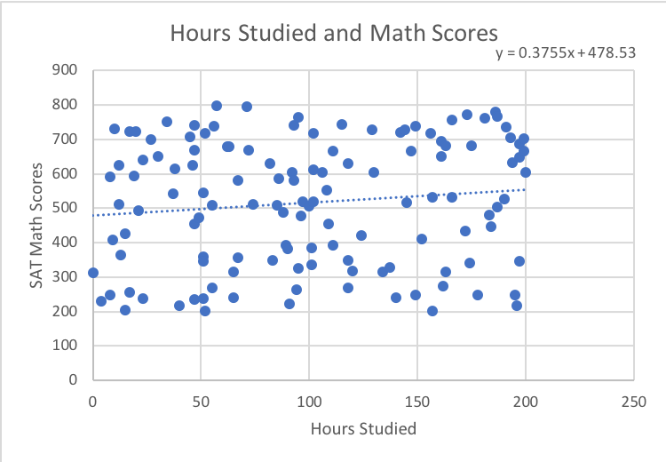
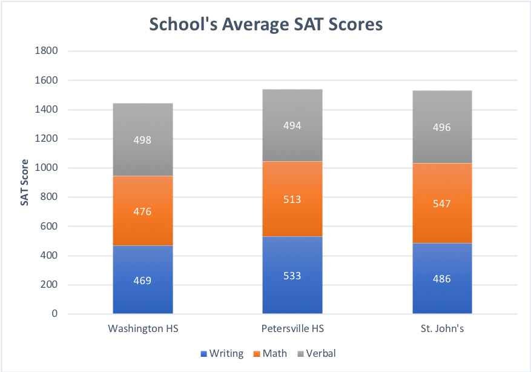
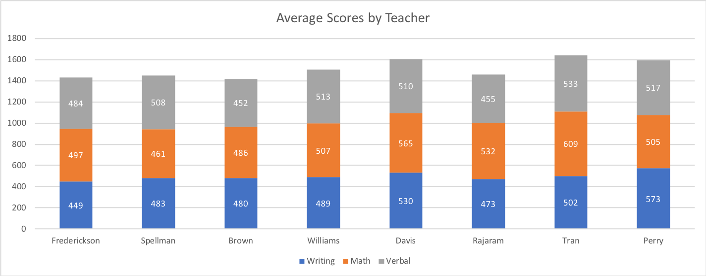
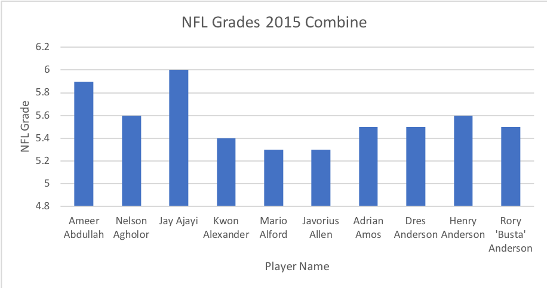
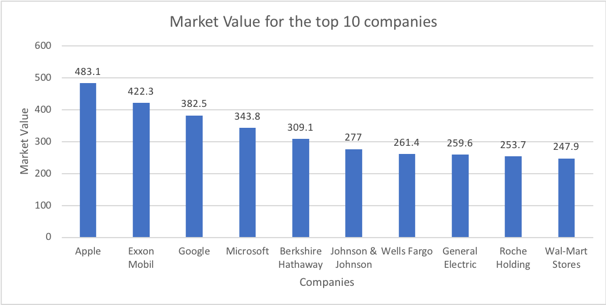

# ICA-4
Work done at USF with SQL codes and corresponding graphs. 

## Description of datasets.sat_scores
Table contains SAT scores and hours studied for different schools, teachers, and students.

## Question #1
How does studying affect the Math SAT score?

```sql
Select sat_math, hrs_studied
From datasets.sat_scores
Where hrs_studied notnull
order by hrs_studied ASC
```



## Question #2
What are the average scores for all of the three scores? Average math, average writing, average verbal? Order by school.

```sql
Select school, Avg (sat_writing) as Avg_Writing, Avg (sat_math) as Avg_Math, Avg(sat_verbal) as Avg_Verbal
from datasets.sat_scores
group by school
```



## Question #3
What were each teachers average total score?

```sql
Select teacher, Avg (sat_writing) as Avg_Writing, Avg (sat_math) as Avg_Math, Avg(sat_verbal) as Avg_Verbal
from datasets.sat_scores
group by teacher
```



## Description of datasets.nfl_combine
Table contains information on players in the NFL combine during various years. The information includes features of the players, what colleges they went to, and if they were drafted.

## Question 1
What were the nfl grades of all the players in the 2015 combine? Limit 10 for graph.

```sql
select name, nflgrade
from datasets.nfl_combine
where year = 2015
```



## Description of datasets.forbes_global_2010_2014
Table contains information on companies around the world from the years 2010-2014 including there market value, sales, profits, and assests.

## Question 1
What are the top 10 companies with the highest market values?

```sql
Select company, marketvalue 
from datasets.forbes_global_2010_2014
order by marketvalue DESC
limit 10
```




